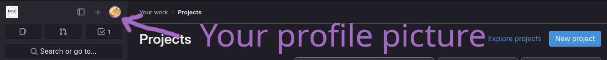
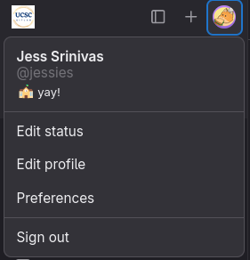

# Creating a gitlab account
{: .no_toc}

## Table of contents
{: .no_toc .text-delta }

1. TOC
{:toc}

{: .warning} These steps are *required* to complete this class. Please be sure to follow them carefully in order to avoid issues.

## What is gitlab

Gitlab is a git server (see [the page on git](git_setup)) for more info on what git is. In this case, when we say "Gitlab", "Git", "UCSC gitlab" or "UCSC git" we are referring to the server at [git.ucsc.edu](https://git.ucsc.edu). This is a gitlab server hosted by the university for instructors and students. Do not use gitlab.com or github.com.

## Creating a gitlab account

Creating an account is the easy part. Navigate to the UCSC gitlab and log in with your CruzID Gold credentials. If you have used gitlab before, you may see projects that you have made in the past. If you have not used git, you may see that you have no projects. This is ok. You do not need to create a new project. The TA's will be running a script every once in a while to create a git project for you for the course of this quarter. 

## Ensuring Correct Account Creation

Occasionally, the UCSC gitlab servers encounter a bug where your account username does not match your cruzid. If you encounter this bug, our scripts will not work and it is your job to fix it. 

{: .warning} You MUST make sure that your account was created correctly, and fix it if it was not to complete the assignments for this class. Please do so immediately after you create your account. 

To check that your account was created correctly, click on your profile picture in the top left corner. 

You should see your name and your cruzid underneath. If you see `@<cruzid>`, you're set! If you see `@<cruzid>1`, you should continue to the next step. 

## Correcting The Issue

If your account was created incorrectly, do the following steps:

1. Click on "Edit profile"
2. Click "Account" on the left side navigation bar
3. On the "Change username" section, change your username to your cruizd. Be sure to type this exactly. 
4. Press "update username"

You're good to go! Be sure that the update has occurred correctly. 
