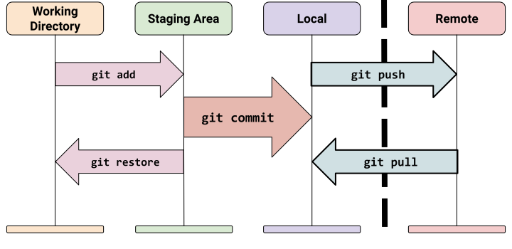

# Using Git
{: .no_toc}

## Table of contents

{: .no_toc .text-delta }

1. TOC
{:toc}

## SSH keys and cloning your repository

First, ssh into your VM. The instructions for this are in the [interface section](interface). 

Once you are in your VM, you need to generate ssh keys so you can prove to GitLab that your computer should be allowed to access your account.

To generate a ssh key pair, run `ssh-keygen` in terminal. You do not need to modify any options.

You should now see 2 new files in the `~/.ssh` folder. These will be called `id_rsa` and `id_rsa.pub`. The file in `id_rsa` is your private key. Do not upload this anywhere, ever. The file `id_rsa.pub` is your public key. This file does not need to be kept secure. It should be in the form of:

    ssh-rsa <many random characters> username@hostname


{: .warning} 
Do not let anyone see your private key. Only copy the contents of `id_rsa.pub`, **not** `id_rsa`.


To prove ownership of your GitLab account, you need to add your public key to the allowed keys. Navigate to the Preferences menu in GitLab, then to "SSH Keys". Press "Add new key" and paste the contents of your public key. You may change the key title if you wish, but you do not need to modify any other settings. 

You can now clone your git repo! Navigate to your repository and press the "Clone" button. Press the clipboard button associated wtih the "Clone with SSH" option. 

Use `git clone <repo url>` with the SSH url in your terminal.

## More on Git

by Sneha De

{: .no_toc}

## TL;DR: The Git Workflow

For most of your assignments and projects that you do individually, all you have to remember is:

```bash
git add <file1> <file2> …
git commit -m "committing!"
git push [origin main]
```

1. Adding (there is no "deleting", "adding" in `git` means staging a change) files with changes (creation, modification, renaming, deletion, etc.)
2. Commit the staged changes with a message
3. Pushing the commit onto the remote.  

{. .tip}
The two optional parameters are the remote name and the branch to push, I recommend specifying these each time to prevent errors. `git push origin main` says push local commits onto the remote called `origin` on the branch called `main`.

## Under the hood

* A Git **repository** is a home for code and is identifiable by the `.git` folder. **Do not** mess with anything inside `.git` unless you know what you're doing!
    * The settings within `.git` are modified through `git config` commands.
* A **commit** is a snapshot of your repo at a point in time. Developers often commit after substantial progress as a checkpoint in their work. Please commit often, especially when you make a breakthrough.
    * In their most simplest form, commits are in linear, chronological order. 
    * That is, if you make changes to fileA at timeA, then later make changes to fileB at timeB, the commit made at timeA does not have the latest changes to fileB. Meanwhile, the commit made at timeB will also include information in timeA, plus any new changes.
* Every commit has a 40-character **has** associated with it.
    * These are unique identiifers of a particular commit and is what you will be expected to submit onto Canvas.
    * Obtained via the Code -> Commits and then clicking the appropriate clipboard for a commit, or via `git log`.
* A **remote** is the *online* version of your *local* (i.e, what you see in your file directory) repository.
    * Remotes are often named, such as the classic `origin` which is the usual default.
    * The only part of the git process that requires an Internet connection is pushing onto the remote. This means you can *always* work and commit locally, and then push everything later.

The following diagram shows the relationship between the **working directory** (where you are currently coding in), the **staging area** (the preparation for a commit), the **local repository** (where your commits are), and the **remote repository** (the online location).



* A **branch** can be thought of as a parallel version of your repo.
    * This is crucial in collaborating and also in product environments where the `main` branch is reserved for fully-functional and deployed work.
    * For school assignments, it is okay to only use the `main` branch.

## Commands

<> indicates a **mandtory** argument, while **[]** indicates an optional argument.

| Command   | Explanation                                       |
|-----------|---------------------------------------------------|
| **`git clone`** `<url> [name for the resulting directory]`                  | Clone a remote repository into a local directory. |
| **`git add`** `<file1> [file2] … [file_n]`<BR><BR>`git add -f .dotfilename` | Stage a file’s changes into the staging area to be committed in the future.<BR><BR>*This doesn’t mean “add” in the sense that there is also a “git delete”.*  This means to “stage the latest changes, including deletion, of a file.” If you need to delete a file from your repo, you should delete it locally, add that change, and push again.<BR><BR>Dot files (such as `.gitignore`) tend to get ignored by git, force adding it by using the `-f` flag.<BR><BR>NOTE: `git add .` adds ANY modified file into the staging area. I highly recommend **never** doing this, else risk committing something you didn’t want to. Use TAB to autocomplete file names on the command line.|
| **`git restore`**<BR><BR>`git restore --staged <file>`	| Restores a file to the most up-to-date history for it in the commits.<BR><BR>Also used to remove files that were accidentally staged (WITHOUT reverting, just un-staging).|
| **`git commit`**<BR><BR>`git commit -m “string msg”` | Commit files that are in the staging area with a message. You almost always have to specify the -m and commit message.<BR><BR>A commit goes into your local repository, it is not yet to the remote.|
| **`git push`** `[remote] [branch]` | Push commits that are on your local repository onto the online repository. **Local -> Remote.**<BR><BR>As mentioned earlier, I recommend always specifying the remote and branch names, such as “`git push origin main`”, to indicate I am pushing onto the branch called `main` of the remote called `origin`. |
| **`git pull`** `[remote] [branch]` | Pull the remote repository onto your local repository. **Remote -> Local.**<BR><BR>It is good practice to do this before starting any work session, especially if you work across different devices. Many, many horrendous errors can occur if your local and remote repos do not agree on the correct history.|
| **`git log`** | Shows the history of previous commits, their full hash codes, and other information.<BR><BR>Similar to Vim, press q to escape the view, and use the arrow keys to go up and down.<BR><BR>**Note**: if you are unable to push (maybe the GitLab server is not working) your final commit for an assignment, use this to get the hash and submit to Canvas anyway, then push ASAP when it is possible! |
| **`git remote`**<BR><BR>`git remote -v`| Get information about the remotes associated with the repo.<BR><BR>Use the option `-v` to get verbose information about the URLs associated with the remotes. You will usually see a (fetch) and/or (push) to indicate what the remote supports. |
| **`git status`**<BR><BR>`git status -uno` | Get the current status of the repo, including what is currently in the staging area.<BR><BR>Use `-uno` to only see tracked files that have a recorded history within the repo (helpful when you have a crowded folder). |
| **`git checkout`** `<path/branch>` | Update the current working file with the latest version of that file/branch from your local repo. | 
| **`git config`**| Used to configure your Git settings (those files in `.git` are modified through this). If the value you use has spaces, i.e “Sammy Slug”, put quotes around it. |


A common use of `git config` is to set your identity.
* For school assignments, the first thing I do is configure my identity for the local repo so as to not expose my personal email and also have better tracking to the UCSC GitLab. You can set this globally in your VM to be secure.

```bash
git config --global user.email mine@personal.com
git config --global user.name sluggo_wuggo
git config --local user.email slug@ucsc.edu
git config --local user.name “Sammy Slug”
```

### Extra

Here’s some that you would greatly benefit from exploring, and you may have to use when you fall into issues with Git.

| Command   | Explanation                                       |
|-----------|---------------------------------------------------|
| **`git merge`**                  | Attempt to merge the code of two branches into one.<BR><BR>Merge conflicts are a rite of passage. Learning how to deal with them is important. If you are diligent about pushing/pulling as required, you will hopefully not fall into a need to merge. |
| **`git rebase`** | Rebase your branch to settle history. |
| **`git stash`** |  A half-way between saving and committing.<BR><BR> Useful if you want to keep something, but have not committed to it (ha ha). |


## `.gitignore`

A **`.gitignore`** file does just that, it tells the Git system what to ignore when detecting modified files to stage and prevents them from being committed to the repo. These can be specific names of folders or files, or more commonly wildcards to detect anything of a certain file extension,  and each pattern is placed on separate lines (like the examples below). Repos rarely ever contain compiled files or executables, as they are simply meant to be storage for code.

The `.gitignore` file is to be at the top level of your repo (i.e, in the same visible folder as the .git folder) and should generally always exist no matter the project. Some repo hosting sites provide template .gitignore’s when you specify what the primary language of the project will be!

> If git add is not detecting .gitignore, use git add -f .gitignore to force the staging.

For any programming class, it’s generally not appreciated to leave IDE artifacts (`.vscode`, `.idea`, `.metadata`, etc.) as your personal development settings have nothing to do with the code (and may even contain some secrets). For a C class, you should make sure to **never commit object files (extension `.o`) or executables** (these can be harder to track on UNIX where `.exe` is not needed to designate executable files, be aware of what is staged using `git status`!).

The following is an example `.gitignore` for a typical Python project, in which I had some VSCode shenanigans, a virtual environment in a folder called `.venv`, and the potential for compiled Python code to appear. 

**Note: * means any sequence of matching characters. ! negates the ignoring.**

```bash
# Contents of .gitignore
.vscode
.venv
*.pyc
*.exe # to be safe!
!.py  # just in case, make sure to account for all .py files!
```

Now imagine a pedantic C programmer who does not like any other language. In an effort to ban any files from other common languages, their .gitignore may look like:

```bash
# No Python!
*.py
*.pyc

# No Java!
*.java
*.class

# But never any object files :)
*.o
```

### A Note to Mac Users
Mac users often find a settings folder/file called `.DS_Store` in their repos when they develop on Mac (developing on your VM will most likely not cause this problem), please be sure to filter it out in `.gitignore`.

