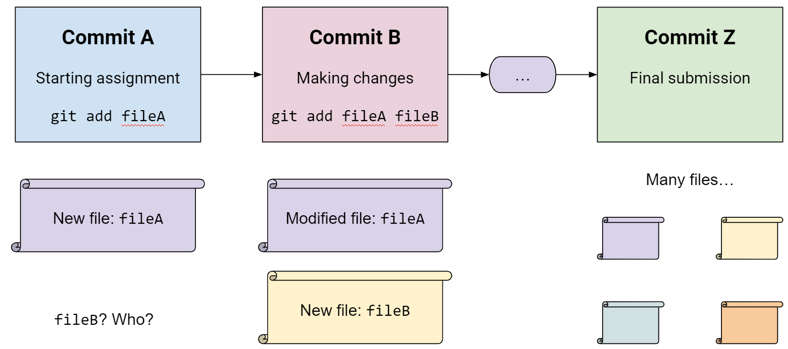

## Cloning your git repository

First, ssh into your VM. The instructions for this are in the [interface section](interface). 

Once you are in your vm, you need to generate ssh keys so you can prove to gitlab that your computer should be allowed to access your account. To do this, run `ssh-keygen`. You do not need to modify any options. 

You should now see 2 new files in the `~/.ssh` folder. These will be called `id_rsa` and `id_rsa.pub`. The file in `id_rsa` is your private key. Do not upload this anywhere, ever. The file `id_rsa.pub` is your public key. This file does not need to be kept secure. It should be in the form 

    ssh-rsa <many random characters> username@hostname


{: .warning} 
Do not let anyone see your private key. Make sure you upload `id_rsa.pub` to gitlab, not `id_rsa`


To prove ownership of your gitlab account, you need to upload your public key. Navigate to preferences in gitlab, and open the "ssh keys" page. Press "Add new key" and paste the contents of your public key into gitlab. You may change the key title if you wish, but you do not need to modify any other settings. 

You can now clone your git repo! Use `git clone <repo url>`

# More git usage

By Sneha De

## Prereqs

Ensure `git` is installed:
```bash
sudo apt install git
```

If you recieve an error like:
```
<username> is not in the sudoers file. This incident will be reported
```

Run the following commands:
```bash
su
password: <your VM password>
usermod -aG $(ls /home)
```


## TL;DR

For most of your assignments and projects that you do individually, all you have to remember is:
```bash
git add <file1> <file2> …
git commit -m "committing!"
git push [origin main]
```

Add, commit, push. Add, commit, push.

Previewing Commands, the “`origin main`” (Note: the default branch may be also be called master) does not have to be specified if you’re working with one remote and one branch (more about these terms later), but it’s the safest way to know exactly where you are pushing, and I recommend those two arguments each time to prevent errors.


## Terms

### Repository

A **repository** (colloquially “repo”) is the crux of your project, containing files, commit history, and other key components of Git. A repository is easily identifiable by folders that contain a hidden .git folder. Do not manually mess with anything inside .git unless you know what you’re doing!

### Commit

A **commit** is a snapshot of your repo at a point in time, think of saving state in a game or this very doc you are reading with its own history. Developers often commit after they implement a new feature or make substantial progress. Commits allow you to recover or revert to earlier versions of your work. Please commit often, especially when you have made a breakthrough on something you were stuck with.

*My CSE13S repo had 138 commits, sometimes 3 within an hour!*

In their most simplest form, git commits are in a linear order. If you commit changes to fileA at timeA, then fileB at timeB, and then finally fileC at timeC, does the commit at timeA contain information about the latest version of fileC? No! 

> Since timeA < timeC, fileC either does not exist within the context of timeA, or timeA contains an older version of the file. timeC will have all of the information of timeA, plus any updates.



### Hash

Every commit has a 40-character commit **hash** associated with it. These are unique identifiers for every commit ever made (a running joke in CS: if you can cheat a git hash, you’ll get your whole degree right then). The short form of a hash is usually the first 8 characters, but you will most likely turn in the entire hash. This can be obtained on the GitLab site, or by copying from git log (more on this in Commands)

