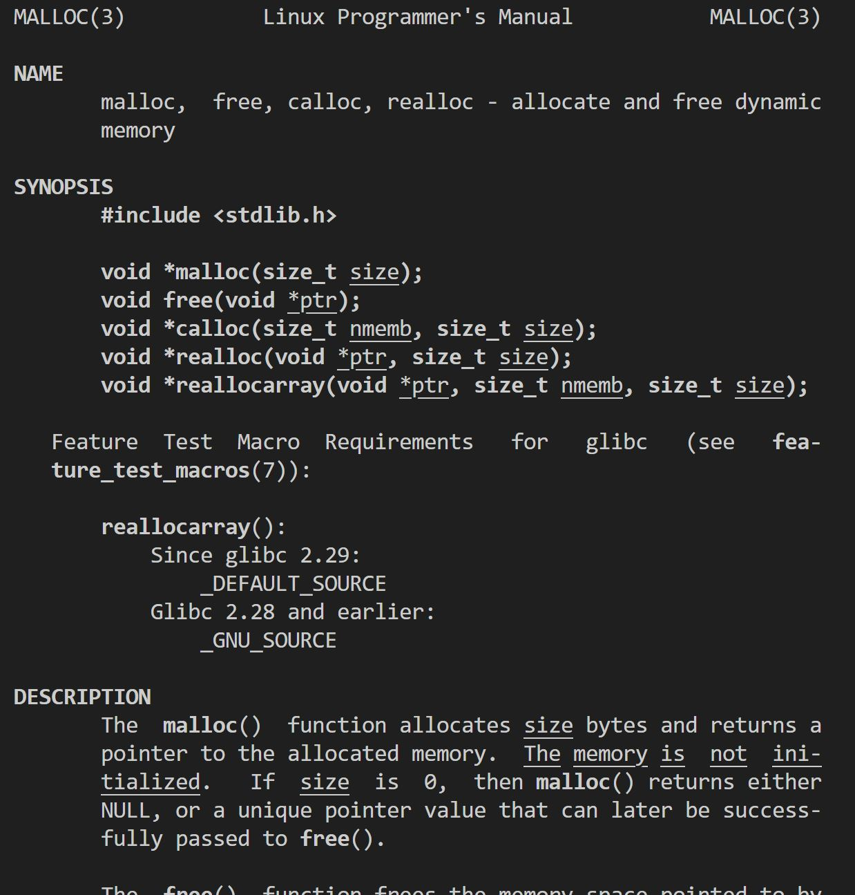

# Using the Command Line
{: .no_toc}

## Table of contents
{: .no_toc .text-delta}

1. TOC
{:toc}

## Basic Command usage
Unix is primarily designed to be used via a terminal. This is also supposed to include getting help and documentation. Because web based documentation is out of the picture, most programs include help messages and manual pages. You can always consult those for help. This page will not cover how to navigate files and the file system in UNIX. 

{: .tip}
It is *very* hard to learn how to use something by reading a guide. Try these commands yourself.

## Getting Help

## The `man` pages
`man` is short for manual. The manual pages are divided into chapters, each of which explain how to use various parts of the system. 

To close a man page, simply type `q`.

`alias woman=man` if you want to be funny.

Manpages don't just give you documentation for unix commands, but also for standard C functions. If your VM didn't automatically install them, you can use `$ sudo apt install manpages` to get them.

To read the manpages, you can use the command `$ man <unix command name/C function name>`. For example, `$ man cd` or `$ man malloc`. The manpages will give you a pretty in-depth explanation on what they do.

Here's some of malloc's manpage:

If you want to keep your terminal window free to work in, manpages are also available [online](https://www.man7.org/linux/man-pages/man3/malloc.3.html).

## `echo`
The `echo` command writes any text following it to the terminal

Try running `echo hello`

## `sudo`
`sudo` is short for "Super User DO". It is a way of running a command as the root user (administrator) without being logged into the administrator account. By default, the root account is disabled, and you can only access it by running commands with `sudo`. 

To use the `sudo` command, your user account must be in the `sudoers` group. Your first user account will be in the group by default, any other accounts may not be. 

`sudo` is dangerous. You can very easily wreck your whole VM if you use it wrong. Be careful when you type any command that starts with `sudo`. 

To test the sudo command, you can run 

`sudo whoami`

the `whoami` command returns the username of the account which ran the command. If you run `whoami` as sudo, you may notice that this will return `root`

On the other hand, if you run `whoami`, it will return your username, not root.

## `apt`
Unlike installing software on Windows and Mac os, Linux uses a package manager. This is somewhat similar to an app store, except that everything is free, and it's actually useful. The default package manager is `apt` on debian based systems, like ubuntu. 

`apt` is a wrapper for `apt-get`. For most of your usage of debian based linux distributions (like ubuntu), you will want to use apt. Most features of `apt` must be run as `sudo`. This means you must run `sudo apt update` instead of `apt update` to avoid getting a permission denied error. 

### `apt update`
This checks for any available updates for your system. It does not install them. This updates the list of available software for your operating system.

### `apt upgrade`
This will update any packages that need an update. You may need to restart to for some updates to apply fully, but for the most part, you don't. 

### `apt install`
This allows you to get new packages. If you know the name of a package you need to install, you can use `apt install <name>` to install it on your computer. For example, if you want to install valgrind,  you can type `apt install valgrind`. Remember that all of these commands must be run with sudo. 

### `apt remove`
This does exactly what you think it does. If you have installed a package, you can remove it using `apt remove`

## Combining Commands

While all of these commands aren't very powerful on their own, they become a lot more powerful when you can chain them together. 

### The pipe
the pipe (`|`) operator takes the output of one command and sends it to the next one. Tru running `echo hello | xxd`. You will get how to write "hello" in hex. 

### Running a commmand inside another
To run a command inside another, you can use the `$` and parenthesis. For example, you can run `xxd 

### Redirects
Most commands in bash have some input and some output. 
You can 
### 
