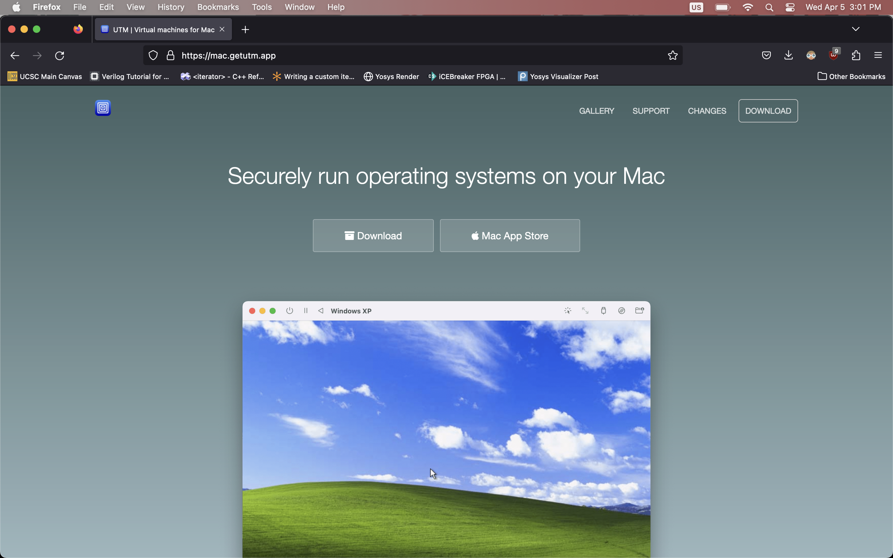
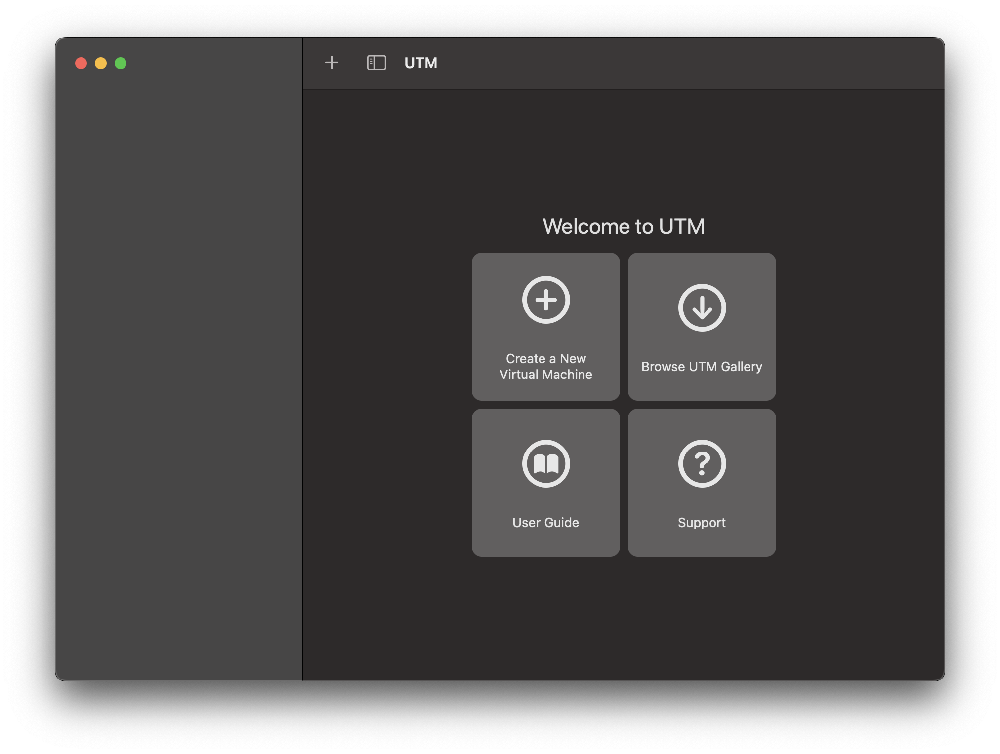
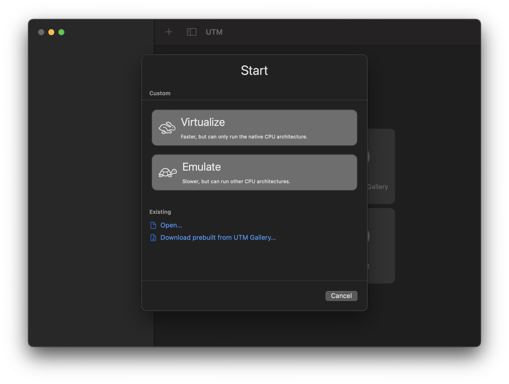
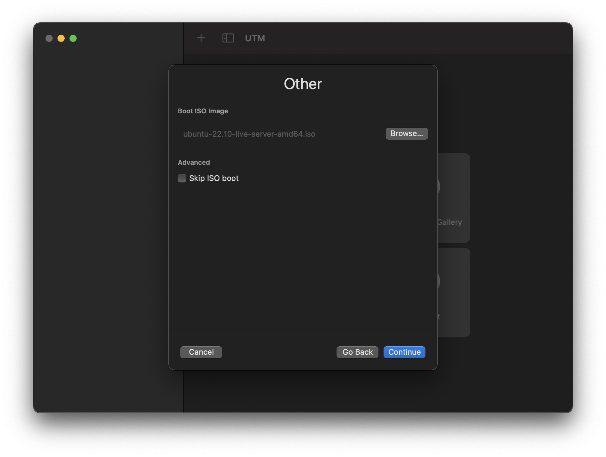
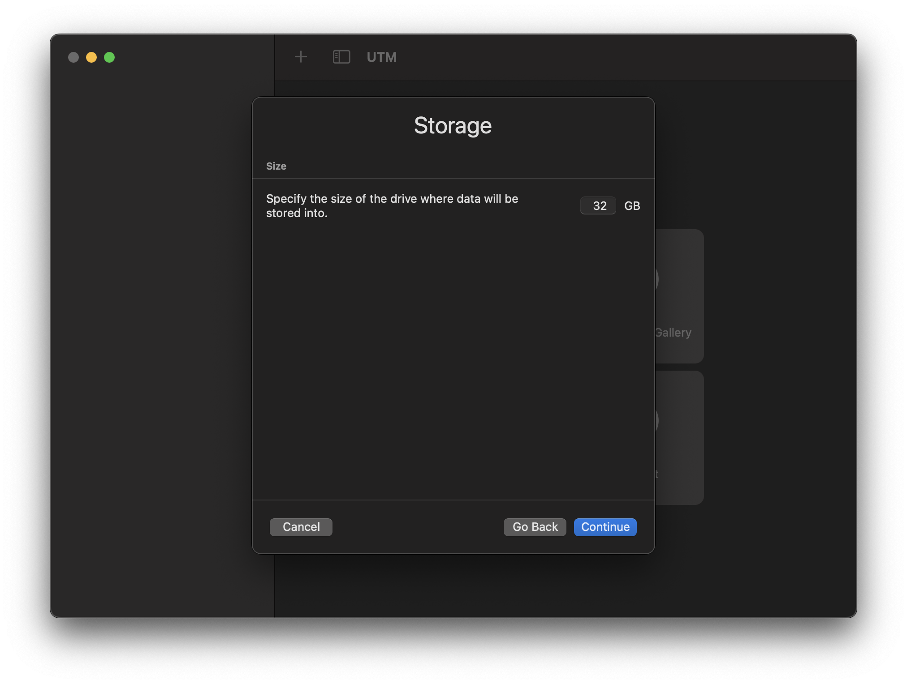
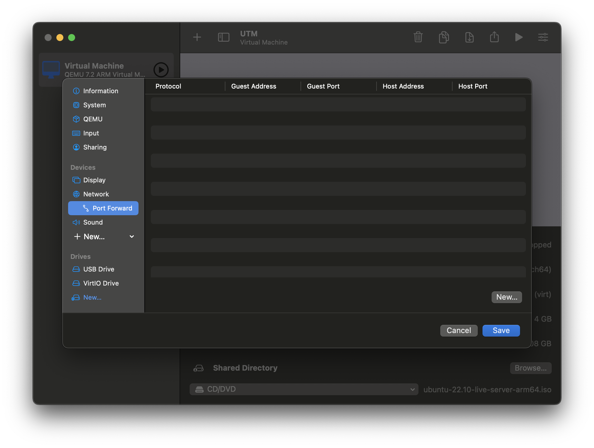

# Setting up UTM
{: .no_toc }

{: .tip}
If you have an Intel Mac, you're in the wrong place!   Look for the Windows/Virtualbox instructions!

## Table of contents
{: .no_toc .text-delta }

1. TOC
{:toc}

## Download UTM

Visit the website for UTM and download the latest version

## Install 

- Install UTM as you would any other Mac Application. Then, open it

## Create a new VM
1. Press "Create VM"

2. Make sure you select "Emulate" not "Virtualize"
, as we will be using an emulated x86 system on arm

3.  Add the ISO file that you downloaded. 

<!-- {: .tip}
Unlike me, **make sure that you are using the ARM64 version**
  Also, make sure it is `ubuntu 22.04-live-server-arm64` -->

4.  Configure your storage, ram and CPU Cores
- you *should* increase your ram to at least 4gb, or more if you have any to spare
- you *should not* change the cores
- you *should* allocate at least 32 gb for your virtual disk file

5.  Press next on other options
- leave the shared directory page untouched

## Setup Port forwarding and SSH

### About Port forwarding and SSH
- ssh: **S**ecure **Sh**ell
- Host OS: the OS that is running on your computer (Mac or Windows)
- Guest OS: The os that we are running in our virtual machine. 

Port forwarding allows us to access services running on our guest OS (Virtual machine) on our Host OS (computer). The service we will be using the most is `ssh`, which will be critical in this course, and probably later in life also. SSH runs on port 22 by default, but can be configured to use anything. Because we may want to run SSH on both our host and guest OSes, we can not use port 22 for our guest OS ssh port. Therefore, we will use 2222, a (usually) open port that is often used as a backup for SSH. 

### Instructions 
- Open settings 
- navigate to network settings
- Change network mode to "Emulated VLAN" (this may not be needed, test)
- The option for "port forward" Should appear, open that menu
- Press "new" in the lower right corner

- Set the host port to 2222, and the guest port to 22
- Save and close

## [Return back to main setup](index)

## See also

- [VM setup](index)
- [Windows and Intel Mac instructions](windows)
- [Installing Ubuntu](ubuntu_2204_server)
- [Interfacing with your VM](/usage/interface)

## Credits
- credit to gary for letting me use his computer to take all the screenshots
