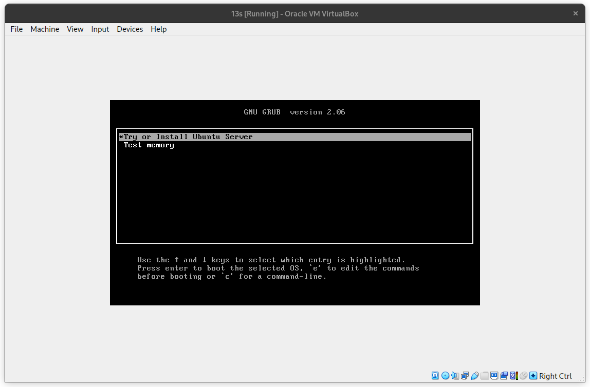
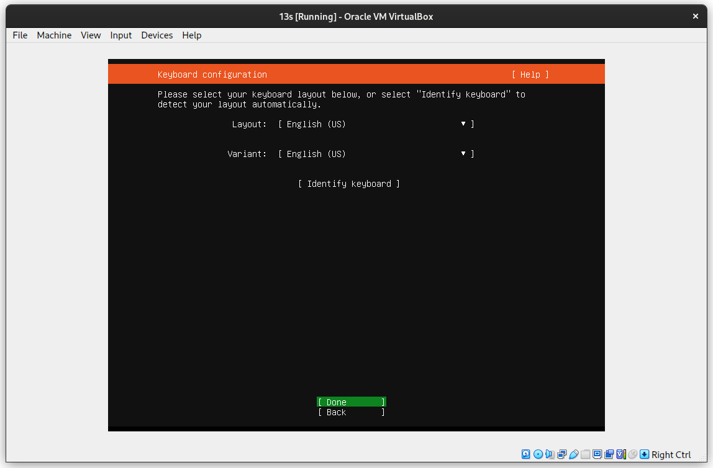
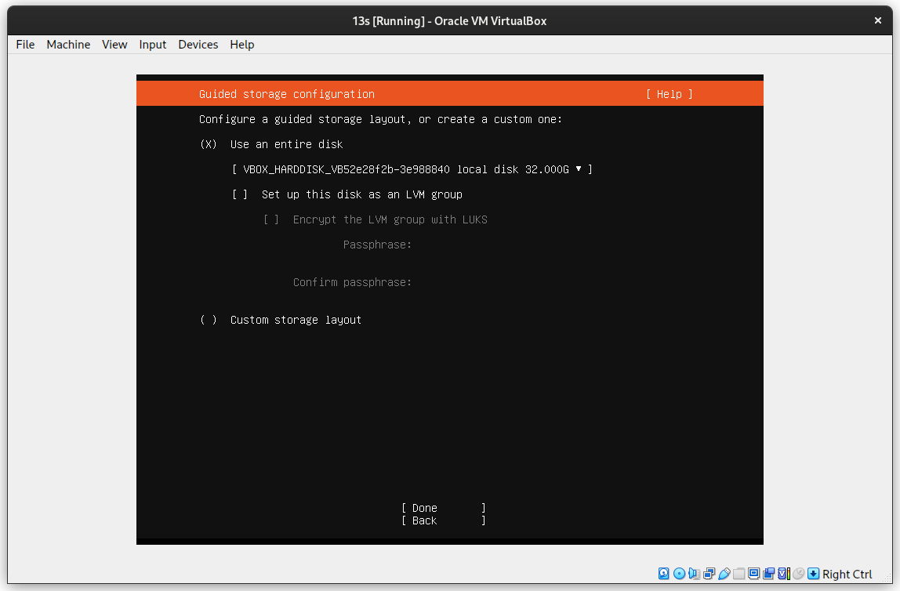
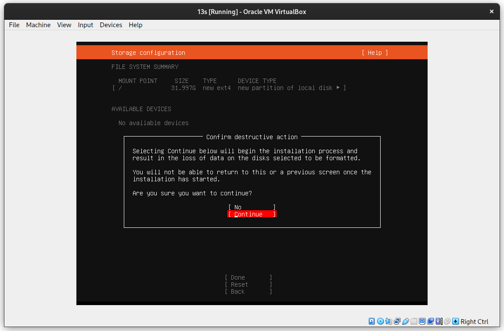
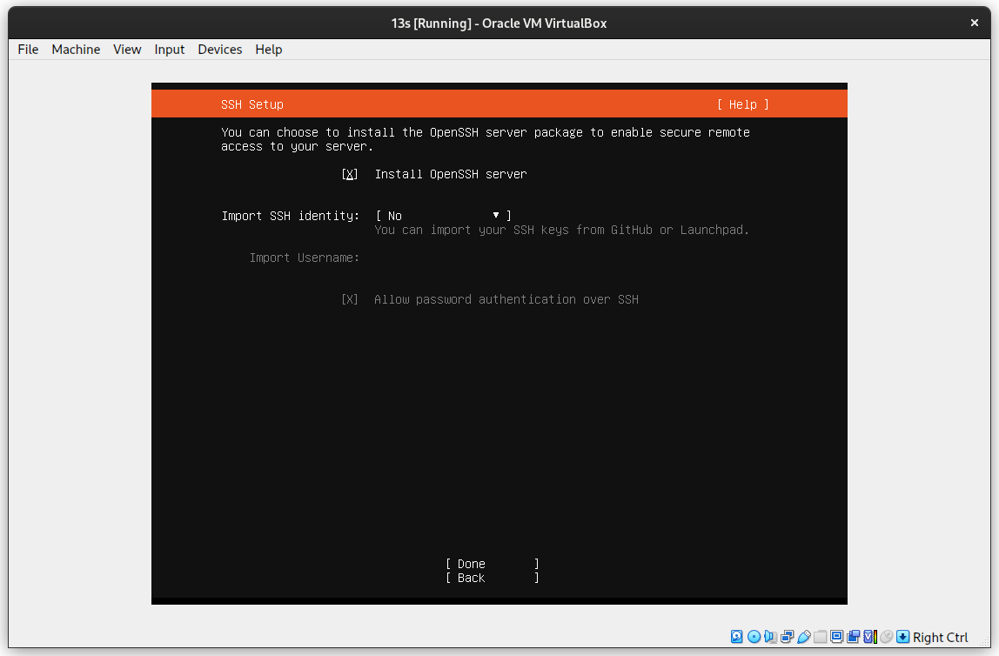
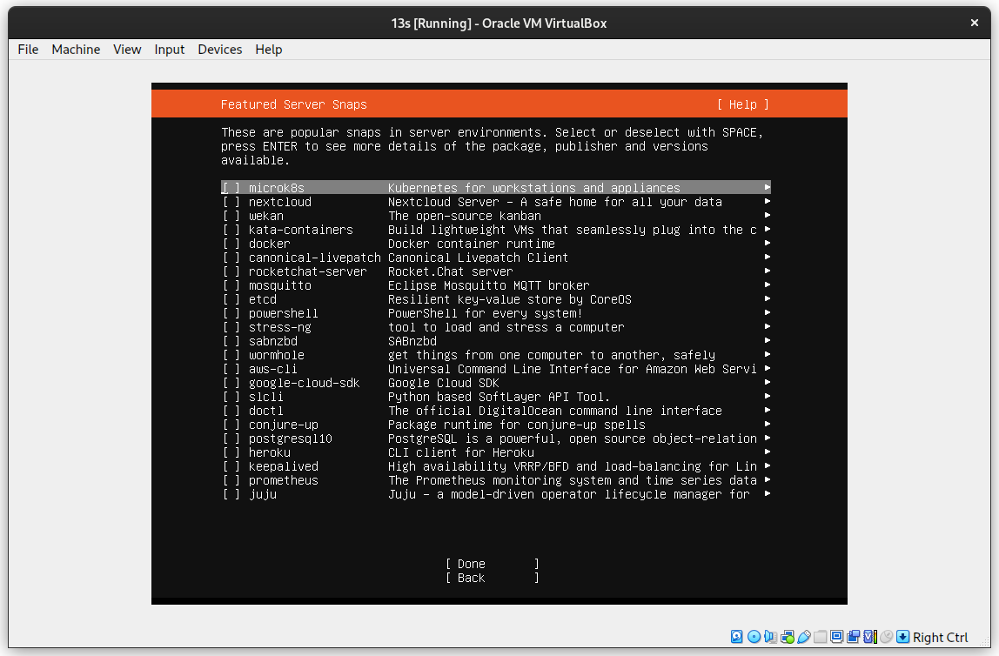
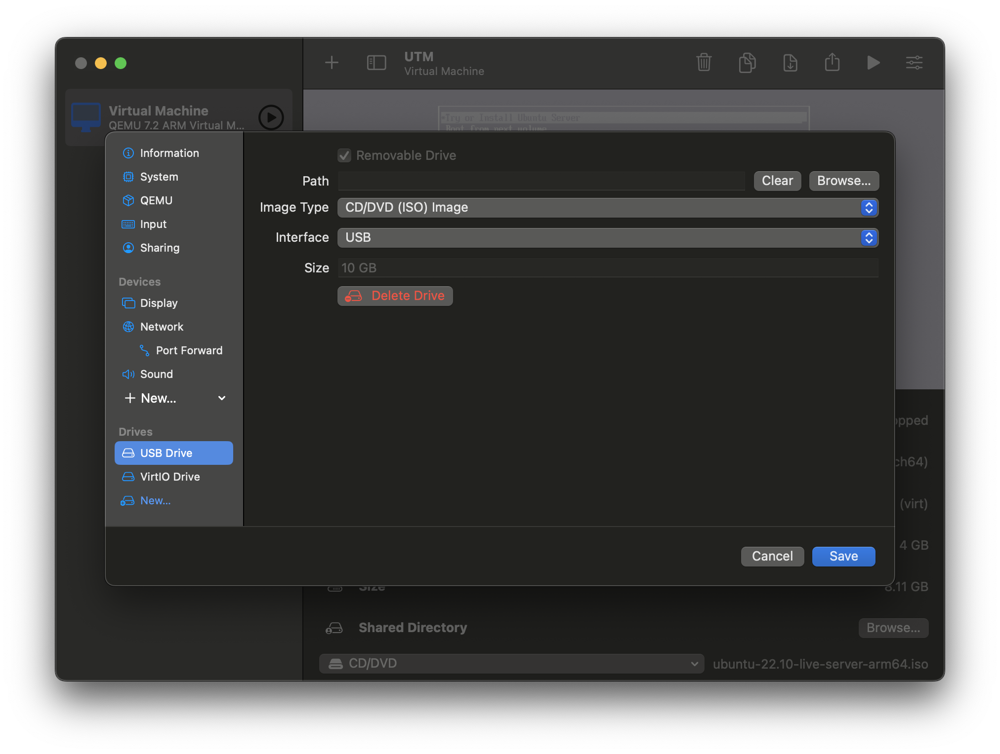
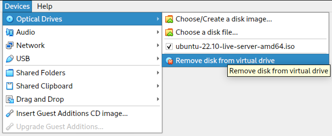

# Installing Ubuntu
{: .no_toc}

## Table of contents
{: .no_toc .text-delta }

1. TOC
{:toc}

{: .note}
For everything that is not covered on this page, you can accept the default and continue!

## Initial Setup
- Configure your language and keyboard as appropriate

## Storage
- Make sure to Turn off LVM!
- Again, **UNCHECK** "Setup this disk as an LVM group"

- You will probably want to use your entire disk. This is your entire *virtual* disk, not the disk on your host machine. Y
- It will prompt you if you want to wipe all data on your disk. This is fine (unless you're installing outside of a virtual machine)

- press "Yes" or "ok" a bunch

## Software
- Check the "Install openssh server" option

- When it asks if you want to install any snaps, just press "Done". 

## Account Info
- Setup a username and password. These can be anything you want
- You will need to remember your password
- You can set the server name to anything you want

## Finishing touches
- press "yes" some more
- If you get a prompt to "Enable Ubuntu pro", select "No"

## Eject the Installation disk.
When you reach the point where installation finishes, you can press "restart now". There is a very good chance that you will see an error that says "[Failed] unmounting /cdrom" or similar. 
This is ok! 
Instructions will vary depending on what Virtual Machine software you are using

UTM

<ul>
<li> Navigate to settings, Drive settings, USB</li> 
 
<li> Press "Delete Drive"</li>
</ul>

Virtualbox

<ul>
<li> Navigate to Devices, in the top bar, optical drives</li> 
<li> Press "Remove Disk From Virtual Drive"</li>
</ul>
 

Once you have ejected your disk, You can restart your VM, and you should be greeted with a terminal. Upon a reboot, you should be greeted with a login prompt. 

## See also:
- [Using Unix](/usage/index)
- [Basic Unix Commands](/usage/unix_commands)